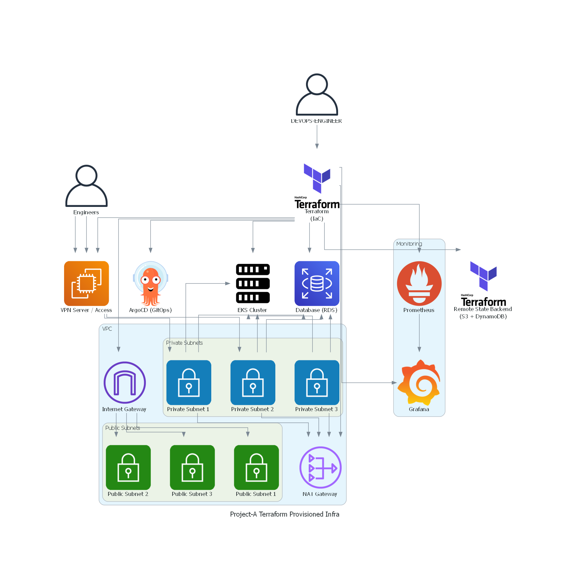

# PROJECT-A-EKS-TERRAFORM

## 📌 Overview

This repository contains a modular, production-ready Infrastructure as Code (IaC) implementation for provisioning a secure and scalable Amazon EKS Kubernetes cluster on AWS using Terraform. 


## Architecture Diagram



### The architecture is designed with:

- Environment isolation (e.g., prod, staging)
- Modular Terraform structure
- Remote state management
- IAM least-privilege principles
- OIDC integration for Kubernetes service accounts
- CI/CD integration readiness
- Production networking standards 
- AWS RDS as database 
- VPN for secure cluster access from engineers to EKS


## 🏗 Architecture Design
Core Infrastructure Components

- Custom VPC with public and private subnets
- NAT Gateway for private subnet egress
- Internet Gateway
- Route tables per subnet tier (HA)
- Security groups with strict ingress/egress rules
- EKS Control Plane
- Managed Node Groups
- IAM roles for:
    - EKS cluster
    - Worker nodes
    - EKS add-ons
    - IRSA (OIDC-based service account roles)
- OIDC provider integration
- ECR integration (for container workloads)
- Optional: EBS CSI driver IAM role configuration


## 📂 Repository Structure
```structure
Project_A_Terraform/
│
├── README.md
├── environment/                # Environment-specific infrastructure
│   ├── dev/                    # Development environment
│   │
│   ├── staging/                # Staging environment
│   │
│   │
│   └── prod/                   # Production environment
│       ├── network/            # VPC, subnets, IGWs, NAT
│       ├── access-vpn/         # VPN access modules/config
│       ├── database/           # RDS / database infra
│       ├── EKS/                # Kubernetes cluster
│       ├── platform/           # Addons like ArgoCD,             
│
├── modules/                    # Reusable Terraform modules
│   ├── VPC/
│   ├── VPN-access/
│   ├── EKS/
│   ├── RDS/
│   ├── IAM/
│   ├── Argocd/
│   └── encryption-secrets/
│
└── remote-state/               # Remote state backend configs (S3/DynamoDB)
```

## Design Philosophy

- modules/ contains reusable infrastructure components
- environments/ contains environment-specific instantiations
- Separation of networking and cluster layers
- reducing infrastructure blast reduis
- Remote state is consumed using terraform_remote_state data sources 


## 🔐 Security Best Practices Implemented

- IAM roles follow least privilege principle
- No hardcoded credentials
- EKS uses OIDC provider for IRSA
- Eks, Worker nodes, database are placed in private subnets
- API server access controlled via security groups
- Remote state stored securely in S3
- DynamoDB used for state locking
- Security group rules explicitly defined (no overly permissive rules)
- best standard practice used  


## 🌍 Remote State Backend
Terraform state is stored in:

- S3 bucket (versioning enabled)
- S3 bucket encrypted
- DynamoDB table for state locking

###  Example backend configuration:
```hcl
terraform {
  backend "s3" {
    bucket         = "your-terraform-state-bucket"
    key            = "prod/eks/terraform.tfstate"
    region         = "us-east-1"
    dynamodb_table = "terraform-lock-table"
    encrypt        = true
  }
}
```
This ensures:
- State consistency
- Team-safe collaboration
- Protection against concurrent applies

## ⚙️ Deployment Workflow
#### NOTE: you must have terraform installed in your terminal 
#### Apply each in different state directory 
1️⃣ Initialize Terraform
```hcl
terraform init
```

2️⃣ Validate Configuration 
```hcl
terraform validate
terraform fmt -check
```

3️⃣ Plan Infrastructure
```hcl 
terraform plan -out=tfplan 
```

4️⃣ Apply Changes
```hcl 
terraform apply tfplan
``` 
