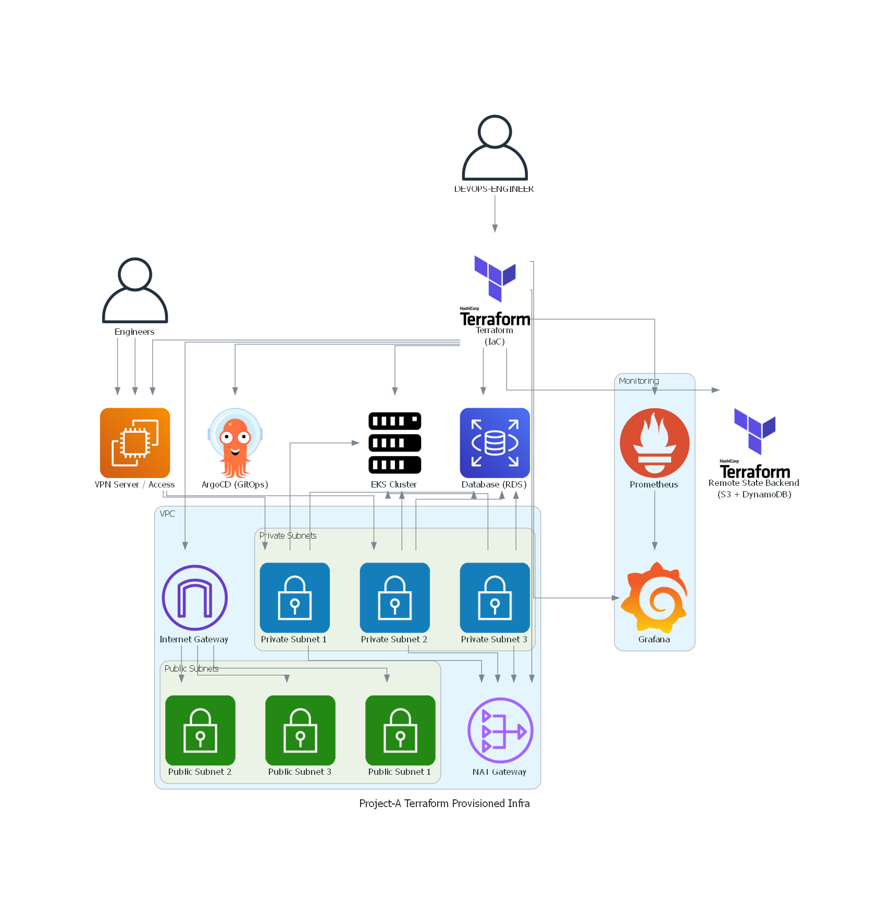

# Project A – AWS EKS Infrastructure (Terraform)

##  Overview

This repository contains a **production-grade Infrastructure as Code (IaC) implementation** for provisioning a secure, scalable, and highly available Kubernetes platform on AWS using Terraform.

The infrastructure is designed using **modular architecture, environment isolation, and GitOps-ready principles**, enabling safe, repeatable deployments across multiple environments (dev, staging, production).

---

## Architecture



### Key Design Highlights

* Multi-environment architecture (**dev, staging, prod**)
* Fully **modular Terraform structure** for reusability and scalability
* Secure **private networking (no public exposure for core services)**
* **Amazon EKS** with managed node groups
* **AWS RDS** deployed in private subnets
* **VPN access layer** for secure engineer connectivity
* **OIDC + IRSA integration** for fine-grained pod-level AWS permissions
* **GitOps-ready platform** (ArgoCD integration)
* Production-grade networking and security best practices

---

## Core Infrastructure Components

### Networking

* Custom **VPC with public and private subnets (multi-AZ)**
* **NAT Gateway** for outbound internet access from private subnets
* Internet Gateway for public routing
* Dedicated route tables per subnet tier
* Strictly defined **security groups (least privilege)**

### Kubernetes (EKS)

* Managed **EKS control plane**
* Managed node groups for worker nodes
* OIDC provider enabled for IRSA
* IAM roles for:

  * Cluster
  * Worker nodes
  * Add-ons
  * Service accounts (IRSA)

### Database Layer

* **Amazon RDS (MySQL)** deployed in private subnets
* No public access (VPC-only connectivity)
* Integrated with Kubernetes workloads securely

### Access & Security

* **VPN access** for secure administrative connectivity
* IAM-based authentication and authorization
* No hardcoded credentials anywhere in the codebase

### Platform Add-ons

* ArgoCD (GitOps continuous delivery)
* Observability stack (Prometheus, monitoring integration)

---

##  Repository Structure

```structure
Project_A_Terraform/
│---- CICD
├── environment/
│   ├── dev/
│   ├── staging/
│   └── prod/
│       ├── network/
│       ├── access-vpn/
│       ├── database/
│       ├── EKS/
│       └── platform/
│
├── modules/
│   ├── VPC/
│   ├── VPN-access/
│   ├── EKS/
│   ├── RDS/
│   ├── IAM/
│   ├── Argocd/
│   ├── Observability/
│   └── encryption-secrets/
│
└── remote-state/
```

---

##  CI/CD – GitHub Actions (Reusable Workflow)

Infrastructure deployment is automated using **GitHub Actions with reusable workflows**, enabling consistent and controlled Terraform operations across environments.

### Key Features

* Reusable workflow for **plan and apply**
* Environment-based deployments (dev, staging, prod)
* Validation (`terraform validate`, `fmt`)
* Security scan and check on code
* Plan approval before apply (safe deployments)
* Separation of concerns between workflow caller and executor

### Example Workflow Usage

```yaml
jobs:
  terraform:
    uses: ./.github/workflows/terraform-reusable.yml
    with:
      environment: prod
      working-directory: environment/prod/EKS
```

### Benefits

* Enforces **standardized Terraform execution**
* Reduces duplication across pipelines
* Enables **safe, auditable infrastructure changes**
* Aligns with **GitOps and CI/CD best practices**

---

##  Design Principles

* **Modular Architecture** → Reusable Terraform modules across environments
* **Separation of Concerns** → Network, compute, database, and platform layers isolated
* **Environment Isolation** → Dev, staging, and production fully separated
* **Remote State Sharing** → Cross-layer dependencies managed via `terraform_remote_state`
* **Minimal Blast Radius** → Changes scoped per layer/environment

---

##  Security Best Practices

* IAM roles follow **least privilege principle**
* **IRSA (OIDC)** for secure pod-level AWS access
* All critical resources (**EKS, RDS, nodes**) deployed in private subnets
* No hardcoded credentials and secrets managed securely
* API server access restricted via security controls
* Encrypted S3 backend for Terraform state
* DynamoDB used for **state locking and concurrency control**
* Explicit security group rules (no overly permissive access)

---

##  Remote State Management

Terraform state is securely managed using:

* **S3 bucket** (versioned and encrypted)
* **DynamoDB table** (state locking)

```hcl
terraform {
  #my remote state backend for my network
  backend "s3" {
    bucket         = "felix-terraform-kubernetes-state"
    dynamodb_table = "project-a-kubernetes-state-locking"
    key            = "prod/network/terraform-state.tfstate"
    encrypt        = true
    region         = "us-east-1"
  }
}
```

---

##  Cost Optimization Strategy

* **Right-sized node groups** to avoid over-provisioning
* **Horizontal Pod Autoscaler (HPA)** reduces compute waste
* **Private subnets** reduce exposure and unnecessary public costs
* **Layered deployments** prevent unnecessary resource recreation
* **Environment-based scaling** (dev/staging use minimal resources)
* Designed to integrate with **Cluster Autoscaler** for dynamic node scaling

---

## Failure Scenarios & Resilience

This infrastructure is designed to handle real-world failure cases:

### 1. Node Failure

* Managed node groups automatically replace unhealthy nodes
* Kubernetes reschedules pods across available nodes

### 2. Pod Crash / Application Failure

* Kubernetes **self-healing** restarts failed containers
* Liveness/readiness probes ensure unhealthy pods are replaced

### 3. Database Connectivity Issues

* Private networking ensures stable internal communication
* Application retries and backoff strategies expected at app layer

### 4. Terraform State Conflict

* DynamoDB locking prevents concurrent state corruption
* S3 versioning allows recovery from state issues

### 5. Failed Deployment

* Terraform plan validation prevents unsafe changes
* CI/CD pipeline enforces controlled apply process

---

##  Deployment Workflow

Infrastructure is deployed in **layered order**:

```
Network -> EKS -> Platform → Database → VPN -> Add-ons ...
```

```bash
terraform init
terraform validate
terraform fmt -check
terraform plan -out=tfplan
terraform apply tfplan
```

---

##  Production Capabilities

* Highly available Kubernetes workloads (multi-AZ)
* Secure backend services with private database access
* GitOps-based deployments via ArgoCD
* Observability-ready platform
* Secure engineer access via VPN

---

##  Key Engineering Decisions

* **Private-first architecture** → reduces attack surface
* **IRSA over static credentials** → secure AWS access
* **Layered Terraform states** → improved reliability
* **Reusable CI/CD workflows** → consistent automation

---

##  Summary

This project demonstrates a **real-world, production-grade cloud infrastructure** built with Terraform, focusing on:

* Security
* Scalability
* Reliability
* Cost efficiency
* Automation

It reflects how modern DevOps teams design and operate Kubernetes platforms in production environments.
